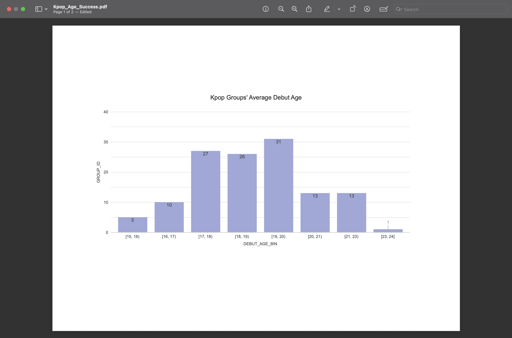
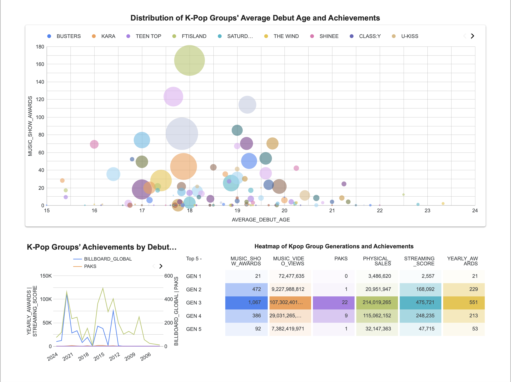

# K-Pop Age & Success Analysis

## 📖 Overview
This project explores the relationship between **K-pop groups’ debut age/date** and their **achievements**, including:
- Awards (yearly & music show wins)
- Music video views
- Physical album sales
- Streaming scores

The goal is to uncover generational trends and correlations between debut timing and long-term success.

---

## 🛠 Tech Stack
- **dbt (Data Build Tool):** For data modeling, transformations, and testing.
- **Snowflake:** Cloud data warehouse storing cleaned and aggregated datasets.
- **PostgreSQL:** Data warehouse storing cleaned and aggregated datasets.
- **Looker Studio:** Visualization layer for charts (scatter, line, heatmap, radar).

---

## 📊 Key Findings
The data collected included members of Kpop groups average ages during debut from teenage years to early twenties. Majority of the average debut age is around 17-20.

Most of the successfull groups are in the so called **3rd generation** of Kpop.
These groups' average debut age are also around **17-20**. 

From this, the success and the members' average age during debut cannot be correlated, since groups from other generations also had the same average debut date but were not as successful.

---

## ℹ Sources
- K-Pop Database dbkpop.com
- Soribada soridata.com 
